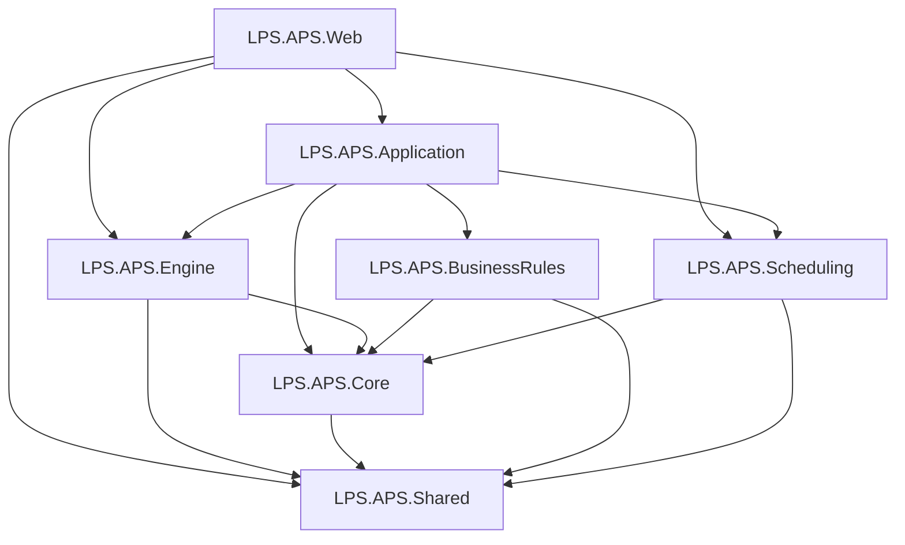

# LPS.APS 高级计划与排程系统

> Lean APS V1.0 — 基于 .NET 8.0 + DDD + 三库物理隔离架构的企业级有限产能排程系统
>
> 设计目标：每日 02:00 全量排程（10 万级 Task），15 分钟极速收敛，彻底免疫老旧 ERP 表结构变更与未来换代冲击

## 项目结构

```
LPS.APS/
├── LPS.APS.Shared/               # 跨层共享基础设施
│   ├── Models/                   # 共享模型（TimeWindow、Job、Machine、ScheduleResult）
│   ├── Configuration/            # 配置选项（Application、API、Business、Redis）
│   └── Extensions/               # DI 扩展（AddSharedServices）
│
├── LPS.APS.Core/                 # 核心领域层 — 单一事实来源
│   ├── Entities/APS/             # APS 库领域实体（30 个：Material、Order、Task、BOM、Routing、Inventory 等）
│   ├── Entities/Auth/            # Auth 库领域实体（11 个：User、Role、Permission、ApprovalFlow 等）
│   ├── Models/                   # 值对象、DTO
│   └── Services/                 # 领域服务
│
├── LPS.APS.Engine/               # 数据引擎层（2 号位）
│   ├── Configuration/            # 数据库配置（三库：APS + ODS + Auth）
│   ├── Data/                     # 数据访问（DatabaseConnectionManager、SqlBulkCopy、AuthDbContext）
│   ├── Repositories/
│   │   ├── Base/                 # 基础仓储（IRepository、BaseRepository 含重试机制）
│   │   ├── APS/                  # APS 本地库仓储（Dapper：Job、Machine、Schedule）
│   │   └── Auth/                 # Auth 权限库仓储（EF Core：User、Role、Permission、AuditLog）
│   ├── Services/
│   │   └── Sync/                 # 数据同步服务集（ERP 订单、工艺路线、BOM、库存）
│   ├── Utilities/                # 工具类（ConsoleHelper）
│   └── Extensions/               # DI 扩展（AddDatabaseServices + Scrutor 自动注册）
│
├── LPS.APS.Scheduling/           # 排程算法层（1 号位独占）— 项目级零数据库依赖
│   ├── Algorithms/               # 核心算法（IntervalTree 时间线段树、TopologicalSort 拓扑排序）
│   ├── DataStructures/           # 高性能数据结构（PriorityTaskQueue 优先级队列）
│   ├── Solvers/                  # 求解器（FiniteCapacitySolver、TimeSlotFinder、SetupOptimizer）
│   ├── Models/                   # 排程模型（SchedulingContext 沙盘、SchedulingTask、SchedulingResult）
│   └── Extensions/               # DI 注册（AddSchedulingServices）
│
├── LPS.APS.BusinessRules/        # 业务规则层（5 号位）— 插件化规则引擎
│   ├── Rules/                    # 规则插件（BatchSplitter、Pegging、LotSizing、Priority）
│   └── Extensions/               # DI 扩展（AddBusinessRuleServices + Scrutor 自动扫描）
│
├── LPS.APS.Application/          # 应用服务层（3 号位）
│   ├── Services/                 # 用例编排（SchedulingOrchestrator、ScheduleQueryService、SnapshotService）
│   └── Extensions/               # DI 扩展（AddApplicationServices + Scrutor 自动扫描）
│
└── LPS.APS.Web/                  # Web API 层（4 号位）
    ├── Controllers/              # API 控制器（Auth、Schedule）
    ├── Extensions/               # Hangfire 配置 + 定时任务注册（UseHangfireJobs）
    └── Program.cs                # 启动配置（DI 组装 + 中间件管线）
```

## 架构设计

### 分层职责与红线

| 层次 | 项目 | 号位 | 职责 | 红线 |
|------|------|------|------|------|
| **Web API** | LPS.APS.Web | 4 号位 | HTTP 接口、JWT 认证、Swagger、Hangfire Dashboard | 不写业务逻辑 |
| **应用服务** | LPS.APS.Application | 3 号位 | 用例编排、事务协调、排程沙盘装载 | 不写计算逻辑 |
| **核心域** | LPS.APS.Core | — | 领域实体、值对象、域服务接口 | 严禁 I/O 操作 |
| **排程算法** | LPS.APS.Scheduling | 1 号位 | 时间槽寻址、换型优化、有限产能求解 | **纯内存、零 I/O、零数据库依赖** |
| **数据引擎** | LPS.APS.Engine | 2 号位 | 三库数据访问、防腐层同步、仓储实现 | 不写业务规则 |
| **业务规则** | LPS.APS.BusinessRules | 5 号位 | Pegging、LotSizing、优先级、批次拆分 | 只写规则插件，返回凭证（Voucher） |
| **基础设施** | LPS.APS.Shared | — | 跨层共享模型、配置选项 | 通用抽象 |

### 依赖关系

```
严格单向依赖，无循环引用：

Web ──→ Application ──→ Core
 │         │   │          ↑
 │         │   ├→ Engine ─┤
 │         │   ├→ BusinessRules ──→ Shared
 │         │   └→ Scheduling ─────→ Shared
 │         │                         ↑
 ├→ Engine ──→ Core ─────────────────┘
 └→ Shared
```



### 三库物理隔离架构

系统采用三库物理隔离，不同数据库使用不同的数据访问技术：

```
┌─────────────────────────────────────────────────────────────────┐
│                   计算标准层 — APS 本地库 (APS_Production)       │
│  ├─ 排程计算结果（Task、Pegging、PlanVersion + 快照归档）       │
│  ├─ 主数据（Material、MaterialMapping、MaterialSupplyContext）   │
│  ├─ 工艺路线（RoutingOperation、RoutingDependency、             │
│  │           RoutingEligibility、PlanningParam、RoutingStage）  │
│  ├─ 订单（ERP_Order_Staging → Order_Canonical → Order）         │
│  └─ 库存（InventoryFact_ERP/MES、InventoryBalance、             │
│           InventorySupplyCandidate、InventorySourceRule）        │
│  数据访问：Dapper + SqlBulkCopy    CommandTimeout: 60s          │
├─────────────────────────────────────────────────────────────────┤
│                集成防腐层 — ODS 库 (MES_Integration)             │
│  ├─ 契约视图（ERP_Master_View、MES_Material_View、ext_* 视图） │
│  ├─ BOM 批量展开（sp_ExpandBOMBatch → StageDetail EDGE/ROOT）  │
│  ├─ BOM 实时展开（紧急插单支持）                                │
│  └─ 数据由 SQL Server Agent Job 驱动 ETL                       │
│  数据访问：Dapper    CommandTimeout: 120s（BOM 展开重）          │
├─────────────────────────────────────────────────────────────────┤
│                权限系统库 — Auth 库 (APS_Auth)                   │
│  ├─ RBAC 权限（User、Role、Permission 多对多）                  │
│  ├─ 数据范围策略（DataScopePolicy）                             │
│  ├─ 审批流（ApprovalFlow、ApprovalNode、ApprovalRecord）        │
│  └─ 审计日志（AuditLog）                                        │
│  数据访问：EF Core 8    CommandTimeout: 30s                     │
└─────────────────────────────────────────────────────────────────┘
```

**数据库配置示例**（`appsettings.json`）：

```json
{
  "Database": {
    "APS": {
      "ConnectionString": "Server=localhost;Database=APS_Production;Trusted_Connection=True;",
      "CommandTimeout": 60
    },
    "ODS": {
      "ConnectionString": "Server=localhost;Database=MES_Integration;Trusted_Connection=True;",
      "CommandTimeout": 120
    },
    "Auth": {
      "ConnectionString": "Server=localhost;Database=APS_Auth;Trusted_Connection=True;",
      "CommandTimeout": 30
    }
  }
}
```

### 防腐层设计（Anti-Corruption Layer）

采用 **Socket-Plug 模式** 隔离 ERP/MES 数据源，APS 代码永不直连外部系统：

```
ERP/MES 数据库
    ↓ SQL Server Agent Job ETL
ODS 契约视图 (ext_v_*)          ← 字段名和类型由 APS 团队定义
    ↓ Dapper + SqlBulkCopy
Staging 暂存表                  ← 原始数据落地
    ↓ 存储过程验证提升
Canonical 标准表                ← APS 标准化口径
    ↓ 分区同步
APS 生产表                      ← 排程引擎消费
```

**核心收益**：ERP 随便改内部结构，只要 DBA 维护好视图映射，APS 代码零修改。

### 凭证交互模式（Voucher Pattern）

5 号位（业务规则）绝对禁止直接修改数据，只返回凭证；2 号位（引擎）统一执行状态变更：

```
5号位.业务规则计算 → 返回 Voucher 凭证 → 2号位.统一执行状态变更 → 沙盘更新
```

典型凭证：`ToleranceClosureVoucher`、`PeggingVoucher`、`FreezeTagVoucher`

### 凌晨全量排程主流程

```
01:50  阶段 0.5：跨域依赖静态扫描（Domain_Dependency 拓扑排序）
02:00  阶段 0  ：Hangfire 触发，创建 PlanVersionId，初始化 SchedulingContext
02:00  阶段 1  ：数据备料（三库快照装载至内存沙盘）
02:05  阶段 2  ：BOM 展开 + Task 实例化 + Pegging 连线
02:10  阶段 3  ：有限产能排程求解（分域并发，IntervalTree 时间槽寻址）
02:25  阶段 4  ：结果持久化 + 快照归档（json.gz）
02:30  阶段 5  ：计划发布 + 冲突检测 + 预警推送
```

## 技术栈

| 类别 | 技术选型 | 用途 |
|------|---------|------|
| 运行时 | .NET 8.0 | 应用框架 |
| 数据库 | SQL Server 2019+ | 三库存储 |
| ORM | Dapper | APS/ODS 库高性能数据访问 |
| ORM | EF Core 8 | Auth 库复杂关系管理 |
| 批量操作 | SqlBulkCopy | 大批量数据写入 |
| 定时任务 | Hangfire | ERP 同步、夜间批量排程 |
| DI 注册 | Scrutor | 按命名空间自动扫描注册 |
| 认证 | JWT Bearer | API 身份认证 |
| API 文档 | Swagger / OpenAPI | 接口文档 |
| 缓存 | MemoryCache | 内存缓存（Redis 可选） |

## 数据同步时序

| 时间 | 任务 | 存储过程 / 服务 |
|------|------|----------------|
| 00:00 | 活跃根订单集合划定 | — |
| 00:05 | 订单全量同步 | ERPOrderSyncService → sp_ValidateAndPromoteOrders → sp_SyncOrdersToPartitionTable |
| 00:10 | 主数据三表协同同步 | sp_SyncMasterData(@SourceType) → Material + MaterialMapping + MaterialSupplyContext |
| 00:15 | 工艺路线同步（5 表 3 视图） | RoutingSyncService → sp_SyncRoutingData |
| 00:20 | BOM 批量展开 | BOMRequestService → sp_ExpandBOMBatch → StageDetail (EDGE/ROOT) |
| 00:25 | 库存快照拉取 | InventorySyncService |
| 00:30 | 订单全量补偿同步 | ERPOrderSyncService（全量模式） |
| 每小时 | 订单增量同步 | ERPOrderSyncService（水位线增量） |

## DI 自动注册（Scrutor）

在对应命名空间下创建 `IXxxService` + `XxxService` 即可，无需手动注册：

| 层 | 扩展方法 | 扫描命名空间 | 生命周期 |
|---|---------|-------------|---------|
| Engine | `AddDatabaseServices` | `Repositories.APS`、`Repositories.Auth`、`Services.Sync` | Scoped |
| Application | `AddApplicationServices` | `Application.Services` | Scoped |
| BusinessRules | `AddBusinessRuleServices` | `BusinessRules.Rules` | Scoped |
| Scheduling | `AddSchedulingServices` | 手动注册（Singleton 纯算法） | Singleton |

```
Program.cs 服务注册流水线：

AddSharedServices         → 配置选项 + MemoryCache
AddDatabaseServices       → 三库连接 + Scrutor 扫描       ← Engine
AddSchedulingServices     → 算法求解器（手动注册）         ← Scheduling
AddBusinessRuleServices   → Scrutor 扫描 Rules             ← BusinessRules
AddApplicationServices    → Scrutor 扫描 Services           ← Application
AddHangfireServices       → 定时任务框架                   ← Web
```

## 实现状态

### 已完成（生产就绪）

**数据引擎层 (Engine) — 44 个源文件**
- 三库连接管理（APS + ODS + Auth）+ 数据库健康检查
- APS/ODS 数据访问（Dapper + SqlBulkCopy）+ 批量操作服务（BulkInsert/Update/Delete）
- Auth 库 EF Core 集成（AuthDbContext + 自动审计字段填充）
- 仓储分层组织（Base/ → APS/ → Auth/）
- ERP 订单同步服务（Staging → Canonical → Partition 三层路径 + 水位线增量）
- 工艺路线同步服务（5 表 3 视图 + sp_SyncRoutingData）
- BOM 请求/结果拉取服务（异步展开 + StageDetail EDGE/ROOT 搬运）
- 库存同步服务（ERP/MES 双源聚合）
- 订单提升服务（sp_ValidateAndPromoteOrders 校验提升）
- 重试机制（仅瞬态 SQL 错误：死锁 1205、超时 -2、TCP 11001）
- Scrutor DI 自动扫描注册

**核心领域层 (Core) — 41 个实体**
- APS 库领域实体：30 个（Material、Order、Task、BOM、Routing 5 表、Inventory 6 表、Pegging、PlanVersion 等）
- Auth 库领域实体：11 个（User、Role、Permission、ApprovalFlow、ApprovalNode、ApprovalRecord、AuditLog 等）

**应用服务层 (Application) — 11 个源文件**
- SchedulingOrchestrator：6 阶段排程编排主流程（沙盘装载 → 求解 → 持久化 → 快照）
- ScheduleQueryService：甘特图数据转换 + 计划版本摘要查询
- SnapshotService：排程快照归档

**排程算法层 (Scheduling) — 7 个源文件**
- IntervalTree 时间线段树（O(log n + k) 重叠查询）
- TopologicalSort 拓扑排序（Kahn 算法，产品族域 DAG）
- PriorityTaskQueue 优先级任务队列
- FiniteCapacitySolver 有限产能求解器（主循环框架）
- SetupOptimizer 换型优化启发式（5 步前瞻）
- SchedulingContext 排程沙盘模型

**Web API 层 — 12 个源文件**
- Swagger 文档 + CORS + 响应压缩 + 异常处理中间件
- JWT 认证 + RBAC 授权
- Hangfire 定时任务集中管理
- 健康检查端点（database-aps、database-ods、database-auth）
- 排程触发 + 甘特图查询 API

**数据库设计（DDL 已就绪）**
- APS_Production 库 DDL v5.0（分区表、防腐层视图、拉链表）
- MES_Integration ODS 库 DDL（BOM 展开请求/结果/归档）
- APS_Auth 库 DDL v1.0（13 张表：RBAC + 审批 + 审计，预置 7 角色 23 权限）

### 待实现

**排程算法核心（1 号位）**
- [ ] IntervalTree.FindFirstAvailableSlot — 可用时间槽极速检索
- [ ] TimeSlotFinder 核心寻址算法 — 倒排/撞墙正排/虚拟库存硬约束
- [ ] FiniteCapacitySolver.Reschedule — 局部重排（锚点锁定 + 推雪机避让）
- [ ] SetupOptimizer 换型矩阵展开

**业务规则插件（5 号位）**
- [ ] Pegging 规则 — 需求-供应批次级绑定 + 断链追溯
- [ ] LotSizing 规则 — 经济批量 + MOQ + 合批策略
- [ ] Priority 规则 — 多目标权重计算（交期 / 客户分级 / 紧急度）
- [ ] BatchSplitter 升级 — 当前为朴素拆分（1 单 = 1 Task），需支持复杂工艺路径

**应用编排增强（3 号位）**
- [ ] SchedulingOrchestrator 完整 BOM 装载集成
- [ ] 规则引擎集成（Pegging / LotSizing / Priority 调用链）
- [ ] 实时插单 ATP 快速通道（目标 ≤ 5 分钟响应）

**前端展示（4 号位）**
- [ ] 甘特图可视化
- [ ] 排程参数配置界面
- [ ] 计划版本对比 + What-If 仿真
- [ ] PSI / 负荷视图（90 天协同视图）

## 快速开始

### 环境要求

- .NET 8.0 SDK
- SQL Server 2019+
- Redis（可选，分布式缓存）

### 编译与运行

```bash
dotnet restore
dotnet build LPS.APS.sln

cd LPS.APS.Web
dotnet run
```

### 访问

| 端点 | 地址 |
|------|------|
| Swagger UI | `http://localhost:5000/swagger` |
| 健康检查 | `http://localhost:5000/health` |
| Hangfire Dashboard | `http://localhost:5000/hangfire` |

## 测试策略

| 层次 | 测试类型 | 方法 |
|------|---------|------|
| Scheduling | 纯函数单元测试 | 内存数据，无数据库依赖 |
| BusinessRules | 规则单元测试 | Mock 数据 + Voucher 断言 |
| Engine | 仓储集成测试 | 内存数据库 / 测试库 |
| Application | 用例集成测试 | 端到端编排验证 |
| Web | API 集成测试 | TestServer + 健康检查 |
| 性能 | 基准测试 | 10 万级 Task / 80 万订单 BOM 展开 |

## 开发规范

### 提交格式

```
<type>(<scope>): <subject>

feat(engine): 实现工艺路线同步服务
fix(scheduling): 修复 IntervalTree 边界条件
docs(readme): 更新架构说明
```

### 架构红线

1. 严守号位职责边界，严禁跨界修改
2. Scheduling 层编译级零数据库依赖 — 引入 Dapper/EF/SqlClient 编译直接报错
3. 5 号位只返回凭证（Voucher），不直接修改数据
4. 数据库结构修改由 2 号位统一执行
5. 所有 ERP/MES 数据必须经过防腐层（ODS 契约视图），禁止直连

### 协作工具

- **版本控制**：SVN
- **AI 辅助**：Windsurf Cascade / Claude Code
- **开发规范**：`.windsurf/rules.md`

## 参考文档

| 文档 | 说明 |
|------|------|
| [APS 数据架构与防腐层设计方案 v5.0](.windsurf/docs/APS_数据架构与防腐层设计方案_v5.0.md) | 三层物理架构、数据管道、Socket-Plug 模式 |
| [APS 核心排产全流程走查 完整版](.windsurf/docs/APS%20核心排产全流程走查%20(完整版).md) | 30 个核心流程、6 阶段排程、跨域协同 |
| [APS 数据库表结构设计 v5.0](.windsurf/docs/APS_数据库表结构设计_v5.0.sql) | APS/ODS 库完整 DDL |
| [APS 数据库字段说明文档 v5.0](.windsurf/docs/APS_数据库字段说明文档_v5.0.md) | 全部表结构与字段定义 |
| [APS 应用层 API 接口规范 v2.0](.windsurf/docs/APS_应用层API接口规范_v2.0.md) | API 接口契约 |
| [APS Auth 数据库 DDL v1.0](.windsurf/docs/APS_Auth数据库DDL_v1.0.sql) | Auth 库 DDL（RBAC + 审批 + 审计） |
| [Auth 库 EF Core 使用指南](.windsurf/docs/Auth库EF_Core使用指南.md) | Auth 库 EF Core 使用示例 |
| [APS 集成接口设计 v1.0](.windsurf/docs/APS_集成接口设计_v1.0.md) | 外部系统集成规范 |
| [研发职责与执行任务包](.windsurf/docs/Lean%20APS%20%20-%20研发职责与执行任务包%20(2).md) | 各号位职责与红线 |
| [技术架构决策说明](ARCHITECTURE.md) | 分层依据、选型理由 |

---

**编译状态**：7 个项目 / 0 错误 / 0 警告  
**技术栈**：.NET 8.0 / Dapper / EF Core 8 / Hangfire / Scrutor / SQL Server  
**数据访问**：APS/ODS 使用 Dapper（性能优先），Auth 使用 EF Core（关系复杂）  
**代码规模**：130+ 源文件 / 41 领域实体 / 44 数据引擎文件  
**架构搭建**：2026-04-03  
**最近更新**：2026-04-22  
**当前阶段**：数据管道已贯通，排程算法核心待实现
